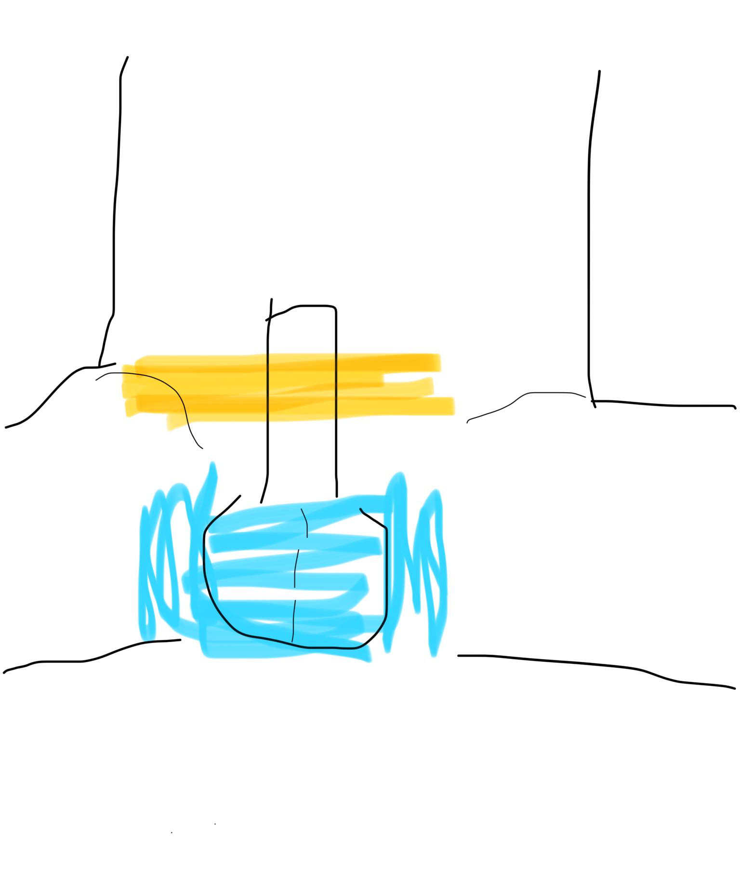
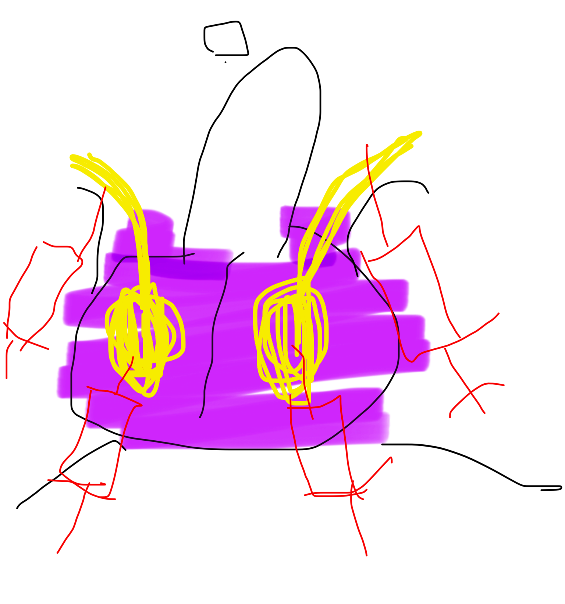
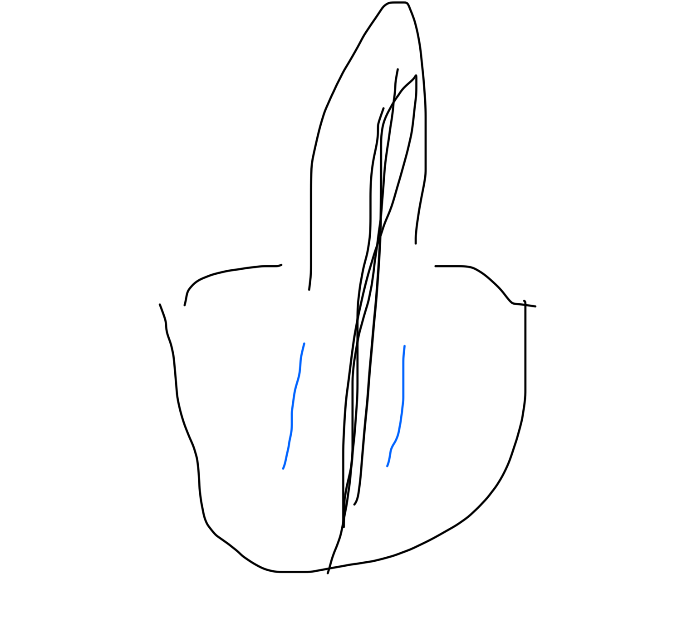

# 自切教程120版（陌璃版）  
不说废话只讲操作😋  
我没有任何医学基础 只会玩玩电脑  
此文章甚至不可以供参考😱  
但我是确实这样切的  
  
第一步：准备  
注射器 5ml/0.6针头的注射器 *4  
注射器 1ml/0.45针头 *4  
止血钳 14厘米 直头 *2  
尖头手术刀无菌一次性 *2  
利多卡因凝胶 10g/200mg *1  
利多卡因注射液 5ml*100mg *5支  
医用棉球 *10   
医用胶带 宽 *1  
碘伏 有效含量大于0.5 400ml  
医用酒精 500ml  
消毒过的地面/床面*1  
120急救 *1  
无菌小罐子 可以把止血钳泡进去  
  
碘伏倒进小罐子  
将止血钳泡碘伏里  
利多卡因注射液吸进5ml/0.6注射器里  
5ml/0.6注射器针头换为1ml/0.45注射器针头  
充满利多卡因注射液的5ml/0.45注射器*4  
  
第二部：切蛋  
禁食12小时 排光排泄物  
找个人看着你别死了 帮你叫120  
  
操作1:消毒  
将鸡鸡固定在肚子上  
  
  
黄色为胶带粘住的位置  
蓝色为碘伏酒精消毒部分  
消毒使用医用棉球  
先碘伏消毒，再酒精消毒  
  
操作2:麻醉  
  
  
  
将利多卡因凝胶均匀的涂在蛋皮上  
图例紫色部分  
等待两分钟  
  
将利多卡因注射液注射到精索中  
手捏住固定住精索 靠近小腹  
图例靠上方的两只注射器位置  
30度进针1厘米左右 回抽没有血  
左右边注射一管  
等待1分钟  
  
将利多卡因注射液注射进睾丸中  
手捏住睾丸  
选一个阴囊没有太多血管的地方  
图例靠下两只注射器位置  
垂直进针1.2厘米左右 回抽没有血  
左右各一管  
注射时会感到睾丸变大  
等待1分钟  
  
操作3:切下来  
  
  
  
  
  
观察唧唧有一条缝合线  
两侧找个没有粗血管的地方  
切开3，4厘米左右切口  
挤出来蛋蛋  
夹住拉出来的精索  
止血钳夹住  
在止血钳仍有一厘米间距的地方  
切下蛋蛋😱  
改花刀后泡进酒精  
  
操作4:结束  
整个过程不要超过20分钟  
并立刻拨打120  
不要动你的止血钳  
120通常会立刻接送你去医院   
安排专业医生的手术  
做好三天不大便的准备  
